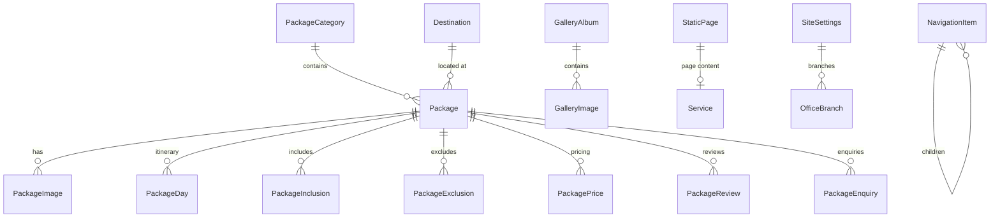

# Blue Lagoon Holidays — Django 5 Migration

Production-ready Django 5 application migrated from the legacy Blue Lagoon Holidays PHP/HTML website.

## Project Structure

```
bluelagoon/
├── manage.py
├── config/                 # Project settings, URLs, WSGI
├── apps/
│   ├── core/               # Home, site settings, navigation, SEO
│   ├── website/            # About, Services, static/landing pages
│   ├── packages/           # Domestic & international packages, itineraries
│   ├── gallery/            # Albums and gallery images
│   └── enquiries/          # Contact form, package enquiries, email
├── templates/              # Django templates (base, header, footer)
├── static/                 # CSS, JS, images (copy from legacy site)
├── media/                  # Uploaded images
├── deploy/                 # Nginx configuration
├── docker-compose.yml
├── Dockerfile
└── requirements.txt
```

## Requirements

- Python 3.12+
- PostgreSQL 14+ (production)
- Optional: Docker & Docker Compose

## Installation

```bash
cd bluelagoon
python -m venv .venv
source .venv/bin/activate   # Windows: .venv\Scripts\activate
pip install -r requirements.txt
cp .env.example .env
```

### Database

**Production (PostgreSQL):** configure `DB_*` variables in `.env`.

**Local quick start (SQLite only):** set `USE_SQLITE=True` in `.env`.

```bash
python manage.py migrate
python manage.py import_legacy_data
python manage.py createsuperuser
python manage.py runserver
```

### Static Assets

Copy legacy `css/`, `js/`, and `img/` folders into `static/`. See `static/ASSETS.md`.

```bash
python manage.py collectstatic
```

## URL Map (Legacy → Django)

| Legacy | Django URL |
|--------|------------|
| `index.html` | `/` |
| `about.html` | `/about/` |
| `services.html` | `/services/` |
| `gallery.html` | `/gallery/` |
| `contact.php` | `/contact/` |
| `destinations.html` | `/packages/domestic/` |
| `international_destinations.html` | `/packages/international/` |
| `international_itinerary.php?id=1` | `/packages/international/golden-triangle/` |
| `more-details.html` | `/packages/domestic/<slug>/` |
| `more-wayanad.html` | `/pages/wayanad/` |
| `more-piligrim.html` | `/pages/pilgrim-packages/` |
| `more_international.html` | `/pages/international-packages/` |

## Model Relationships (ER Diagram)



## Django Admin

Access at `/admin/` after creating a superuser.

| Model | Purpose |
|-------|---------|
| Site Settings | Company info, phones, social links |
| Navigation Items | Dynamic menu with dropdowns |
| Home Slider / Features | Homepage content blocks |
| Package Categories | Domestic, International, etc. |
| Packages | Full package CRUD with inlines for images, itinerary, pricing |
| Gallery Albums / Images | Photo management |
| Contact Enquiries | View submitted contact forms |
| Static Pages | About, Services, landing pages (CKEditor) |

## Features

- **PostgreSQL** data-driven packages (no `if($id==N)` logic)
- **Slug-based URLs** (no ID exposure)
- **Django Forms** with CSRF, validation, rate limiting
- **reCAPTCHA v3** when keys configured; math captcha fallback
- **Email notifications** + customer confirmation
- **SEO**: meta tags, OpenGraph, Twitter cards, sitemap.xml, robots.txt
- **CKEditor** for rich text in admin
- **Whitenoise** + **Gunicorn** + **Nginx** deployment ready
- **Docker Compose** with PostgreSQL

## Deployment (Ubuntu)

```bash
# On server
git clone <repo> /var/www/bluelagoon
cd /var/www/bluelagoon/bluelagoon
python3.12 -m venv .venv
source .venv/bin/activate
pip install -r requirements.txt
cp .env.example .env  # configure production values

python manage.py migrate
python manage.py collectstatic --noinput
python manage.py import_legacy_data

gunicorn config.wsgi:application --bind 127.0.0.1:8000 --workers 3
```

Use `deploy/nginx.conf` as reference. Enable HTTPS with Certbot.

### Docker

```bash
docker compose up --build
```

## Environment Variables

See `.env.example` for all options:

- `SECRET_KEY`, `DEBUG`, `ALLOWED_HOSTS`
- `DB_*` PostgreSQL connection
- `EMAIL_*` SMTP settings
- `RECAPTCHA_*` Google reCAPTCHA keys
- `SITE_URL`, `SITE_NAME`

## Management Commands

```bash
python manage.py import_legacy_data   # Seed packages, navigation, gallery from legacy content
```

## Security

- CSRF protection on all forms
- `django-ratelimit` on contact/enquiry endpoints
- No raw `$_POST` / `mail()` — Django ORM + email backend
- Security headers (HSTS in production)
- Secrets in `.env` only

## Logging

Logs written to `logs/django.log` including enquiry and error events.

## License

Proprietary — Blue Lagoon Holiday Cruises Pvt Ltd.
